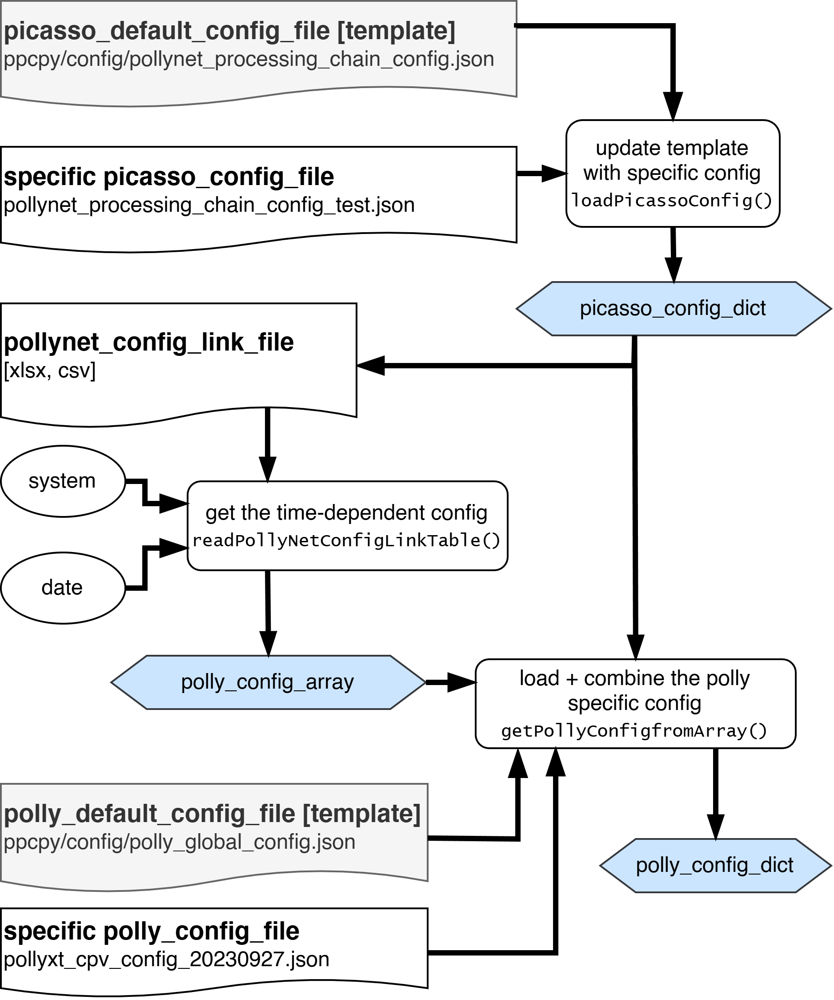

********************
Configuration Files
********************

Three types of input files are needed for the configuration. The ``picasso_config_file``, the ``polly_config_file`` (both with their respective template files),
and a table (``pollynet_config_link_file``) linking the systems, times and ``polly_config_files``. 

They are loaded with the following logic, producing three outputs: ``picasso_config_dict``, ``polly_config_array``, ``polly_config_dict``:

With calling :py:meth:`~ppcpy.interface.picassoProc.PicassoProc`, the two config dicts are combined with the raw data to the ``data_cube``.
They are stored as variables in the ``data_cube``:

.. code-block:: python

    data_cube.polly_config_dict
    data_cube.picasso_config_dict

.. note::
    Compared to the matlab version, the defaults and template (polly_default_default) was merged into the `polly_config_dict`.

Overview on Keys
=================

.. todo::
    The docstrings below are taken from the original matlab documentation.
    They might not reflect also the latest version. `picasso config docs`_.

.. _picasso config docs: https://pollynet.github.io/Pollynet_Processing_Chain/modules/config.html

picasso_config_file
-------------------

.. csv-table::
    :header: "Key", "Description", "Obsolete"
    :file: ../picasso_config_keys.csv

polly_config_file
-------------------

.. csv-table::
    :header: "Key", "Description", "Obsolete"
    :file: ../polly_config_keys.csv
